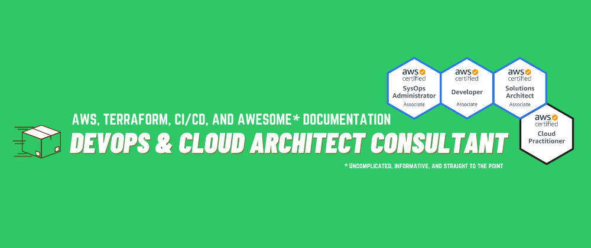
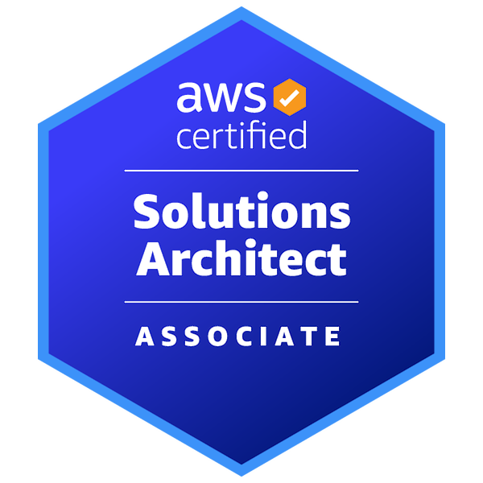
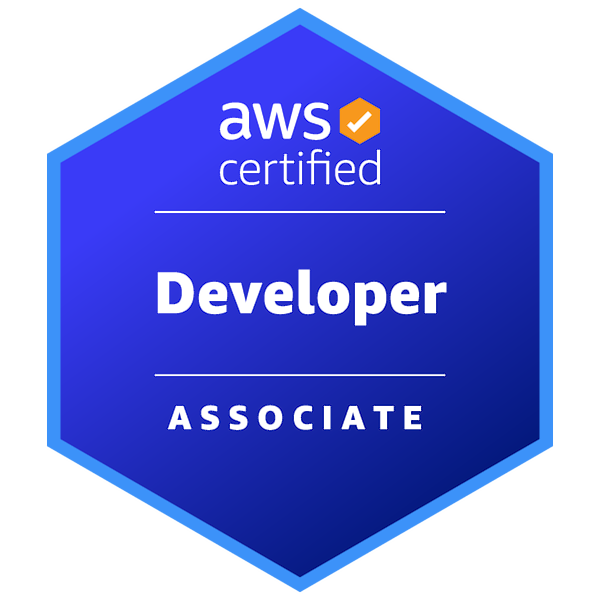
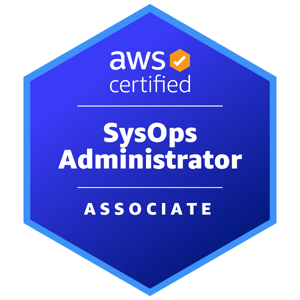
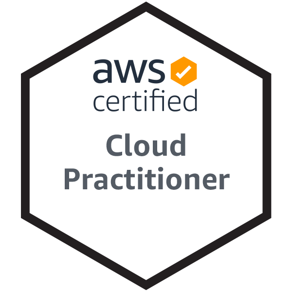
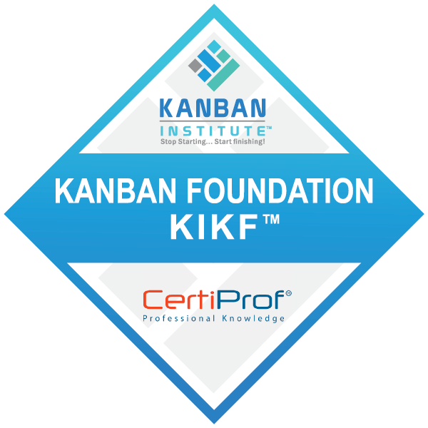
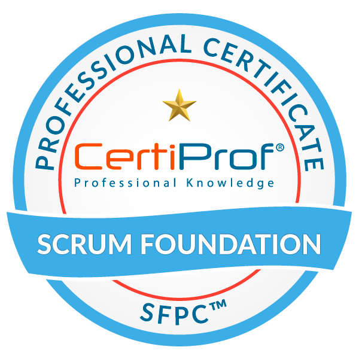

## Hello, nice to meet you
- :raising_hand_man: Caio Marte, 28, :brazil: :portugal: citizen
- :classical_building: Founder and several hats at [@bluebrickco](https://github.com/bluebrickco)
- :briefcase: Cloud architect, strategist, narrative builder, and consultant
- :toolbox: Specialized in AWS, IaC, CI/CD, and writing awesome documentation
- :mortar_board: BoE of Computer Engineering, GPA: 3.7 of 4.0
- :pushpin: Remote worker based in Brasil

## My core experience is
6 years of experience with Cloud & DevOps in 5 customer facing roles and 1 internal role:
- (2024 ~ ) Principal Cloud Architect Consultant at [The BlueBrick Co.](https://www.linkedin.com/company/bluebrickco/) - Worldwide, Remote
- (2022 ~ 2024) Sr Cloud Engineer Consultant at [Caylent](https://caylent.com/) - United States, Remote
- (2022 ~ 2022) DevOps Engineer at [ezyCollect](https://www.ezycollect.com.au/) - Australia, Remote
- (2021 ~ 2022) DevOps Engineer Consultant at [Caylent](https://caylent.com/) - United States, Remote
- (2020 ~ 2021) Cloud Architect Consultant Intern at [AWS](https://aws.amazon.com/professional-services/) - Brasil, Remote
- (2018 ~ 2020) Hybrid Cloud Specialist Pre-Sales Intern at [IBM](https://www.ibm.com/cloud/hybrid) - Brasil, Onsite

### Projects
- 11 consulting projects
- 4 internal projects

*Click <a href="https://www.linkedin.com/in/caiomarte/details/projects/" target="_blank">here</a> to view more information.*

**Main technical stack**
- :cloud: AWS Cloud
- :bricks: Infrastructure as Code
  - Terraform, CloudFormation, CDK
- :building_construction: CI/CD
  - Azure Pipelines, CircleCI, GitHub Actions, Bitbucket, AWS CI/CD stack
- :package: Containers & orchestration 
  - Amazon EKS, Amazon ECS

## My core skills are
| Skill                                      | Experience           | Level      | Main tools                                         |
| ------------------------------------------ | -------------------- | ---------- | -------------------------------------------------- |
| :cloud: AWS Cloud                          | ██████████████████░░ | Senior     | Well-Architected Framework                         |
| :bricks: Infrastructure as Code            | ██████████████████░░ | Senior     | Terraform, CloudFormation, AWS CDK for Python      |
| :building_construction: CI/CD Pipeline     | ██████████████░░░░░░ | Mid-level  | CodePipeline, Azure Pipelines, CircleCI, Bitbucket |
| :package: Container & Orchestration        | ██████████░░░░░░░░░░ | Jr/Mid     | ECS, EKS                                           |
| :arrow_forward: Serverless                 | ████░░░░░░░░░░░░░░░░ | Junior     | Python, Lambda, API Gateway, SQS, DynamoDB         |
| :shield: Governance, Monitoring & Security | ██████████░░░░░░░░░░ | Jr/Mid     | SSM, CloudWatch, Prometheus, Grafana               |
| :male_detective: Compliance                | ██░░░░░░░░░░░░░░░░░░ | Junior     | HIPAA, AWS FTR for Software Partners               |
| :bar_chart: Agile & Lean                   | ████████████████████ | Senior     | Kanban, Scrum, Working Backwards                   |
| :memo: Technical Writing                   | ████████████████████ | Senior     | Customer/User & Project Documentation              |

### Certifications

*Click <a href="https://www.credly.com/users/caiomarte/badges" target="_blank">here</a> to view a list of credentials.*

## You can also find me on
&nbsp;&nbsp;
&nbsp;&nbsp;

*Click <a href="./assets/resume.pdf" target="_blank">here</a> to view my complete resume and <a href="./assets/cover-letter.pdf" target="_blank">here</a> to view my cover letter.*
