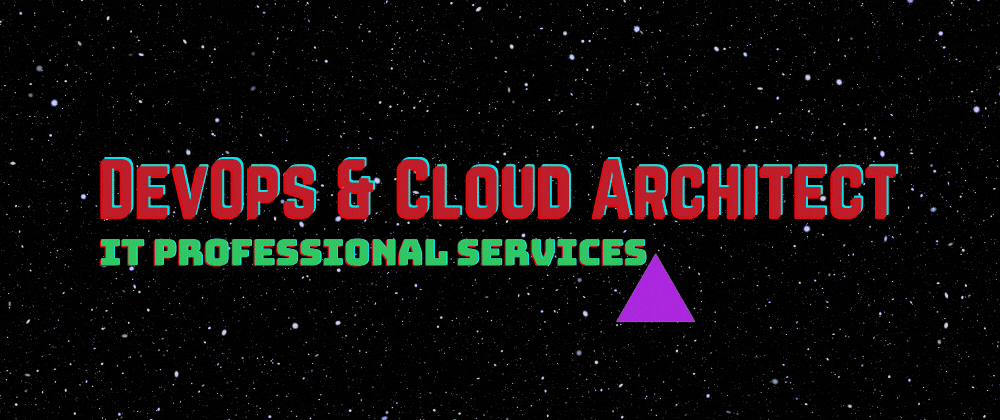

## Hello, nice to meet you
- :raising_hand_man: I'm Caio Marte, 25, Brazilian and soon-to-be Portuguese.
- :pushpin: I'm currently living in São Paulo/SP-Brazil, but available to relocate.
- :dart: My goal is enabling Cloud & DevOps to deliver customer value by default.

## I'm currently working on
- :cloud: Cloud migration from Aptible to AWS
- :gear: Infra as code with Terraform
- :building_construction: CI/CD pipelines on CircleCI
- :package: Kubernetes architecture on Amazon EKS

## I'm currently learning about
- :stethoscope: HIPAA compliance on AWS
- :man_technologist: Go programming language

## My usual stack is
- :cloud: AWS Cloud
- :gear: Terraform
- :building_construction: YAML CI/CD Pipelines
- :man_technologist: Python scripts

## My core skill assessment is
| Icon                    | Skill         | Experience           | Level      | Main tools                                    |
| ----------------------- | ------------- | -------------------- | ---------- | --------------------------------------------- |
| :cloud:                 | AWS Cloud     | ████████████████████ | Mid-level  | Well-Architected Framework                    |
| :gear:                  | Infra as Code | █████████████████░░░ | Mid-Level  | Terraform, CloudFormation, AWS CDK for Python |
| :building_construction: | CI/CD         | █████████████░░░░░░░ | Junior/Mid | CodePipeline, Azure Pipelines, CirlceCI       |
| :package:               | Containers    | ██████████░░░░░░░░░░ | Junior     | ECS, EKS, Kubernetes                          |
| :fog:                   | Serverless    | ███████░░░░░░░░░░░░░ | Junior     | Python, Lambda, API Gateway, SQS, DynamoDB    |
| :bar_chart:             | Agile & Lean  | ████████████████████ | Mid-Level  | Kanban, Scrum, Working Backwards              |

## My contacts and social media are
 

