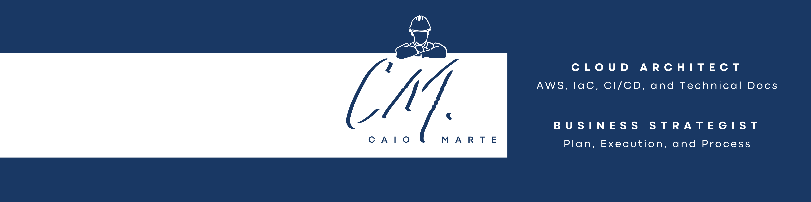
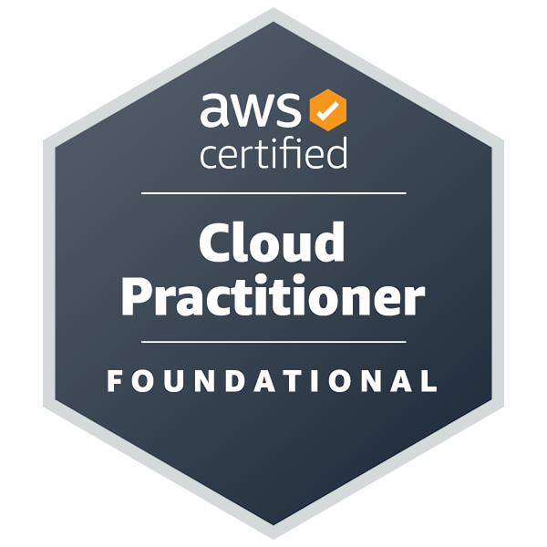

## Hello, nice to meet you
- :raising_hand_man: I'm Caio Marte, 26, Brazilian & to-be Portuguese.
- :mortar_board: Bachelor of Computer Engineering (GPA: 3.7, graduation date: Dec 2021).
- :briefcase: DevOps & Cloud Architect, specialized in AWS, Terraform, CI/CD, and writing awesome documentation.
- :dart: My goal is to help businesses leverage Cloud & DevOps practices to drive customer value by default.
- :pushpin: Living in São Paulo/SP-Brazil, but willing to relocate (remote work only).

## Currently, I have been
**Working on**
- :soon: In between projects

**Learning about**
- :cloud: AWS Certified DevOps Engineer Professional Certification
- :writing_hand: Technical writing

**Doing aside**
- :gear: Writing content about Terraform
- :gear: Building a Terraform library of personal AWS solutions

## My core experience is
Over 3y working with AWS Cloud and DevOps in customer-facing roles:
- (2021 ~ Now) Currently a Cloud DevOps Engineer Consultant at [Caylent](https://caylent.com/)
- (2020 ~ 2021) 1y4 mos a paid Cloud Architect Consultant Intern at [AWS](https://aws.amazon.com/professional-services/)
- (2018 ~ 2020) 1y10 mos a paid Hybrid Cloud Specialist Pre-Sales Intern at [IBM](https://www.ibm.com/cloud/hybrid)

### Projects
**Relevant role in 6 consulting projects**
- **1** leading the technical team
- **2** as the only solutions architect
- **1** as the primary solutions architect
- **1** as secondary solutions architect
- **6** working on deliverables on my own
- **2** creating customer documentation
- **1** creating project documentation

**Main technical stack**
- :cloud: **6** projects related to the AWS Cloud
  - **1** related to application migration
- :gear: **4** projects related to Infrastructure as Code
  - Terraform, CloudFormation 
- :building_construction: **3** projects related to CI/CD
  - Azure Pipelines, AWS CI/CD stack, and CircleCI
- :package: **2** projects related to containers & orchestration 
  - Amazon ECS and Amazon EKS
- :shield: **1** project related to monitoring
  - Amazon CloudWatch and Amazon EC2

## My core skills are
| Skill                                      | Experience           | Level      | Main tools                                    |
| ------------------------------------------ | -------------------- | ---------- | --------------------------------------------- |
| :cloud: AWS Cloud                          | ████████████████████ | Mid-level  | Well-Architected Framework                    |
| :gear: Infrastructure as Code              | █████████████████░░░ | Mid-level  | Terraform, CloudFormation, AWS CDK for Python |
| :building_construction: CI/CD Pipeline     | ██████████████░░░░░░ | Junior/Mid | CodePipeline, Azure Pipelines, CircleCI       |
| :package: Container & Orchestration        | ███████░░░░░░░░░░░░░ | Junior     | ECS, EKS, Kubernetes                          |
| :fog: Serverless                           | ███░░░░░░░░░░░░░░░░░ | Junior     | Python, Lambda, API Gateway, SQS, DynamoDB    |
| :shield: Governance, Monitoring & Security | ██████████░░░░░░░░░░ | Junior/Mid | SSM, CloudWatch, IAM, Security Group, NACL    |
| :bar_chart: Agile & Lean                   | ████████████████████ | Mid-level  | Kanban, Scrum, Working Backwards              |
| :memo: Technical Writing                   | ████████████████████ | Mid-level  | Customer/User & Project Documentation         |

### Certifications

## You can also find me on
&nbsp;&nbsp;
&nbsp;&nbsp;

*Click <a href="./assets/Resume_EN_v29Sep2021_Cloud_DevOps_Architect.pdf" target="_blank">here</a> to view my complete resume*
